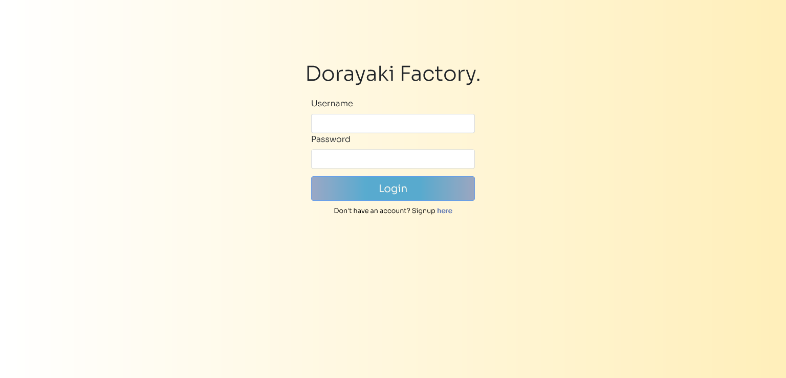
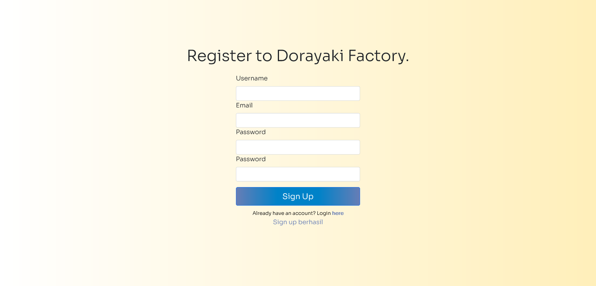
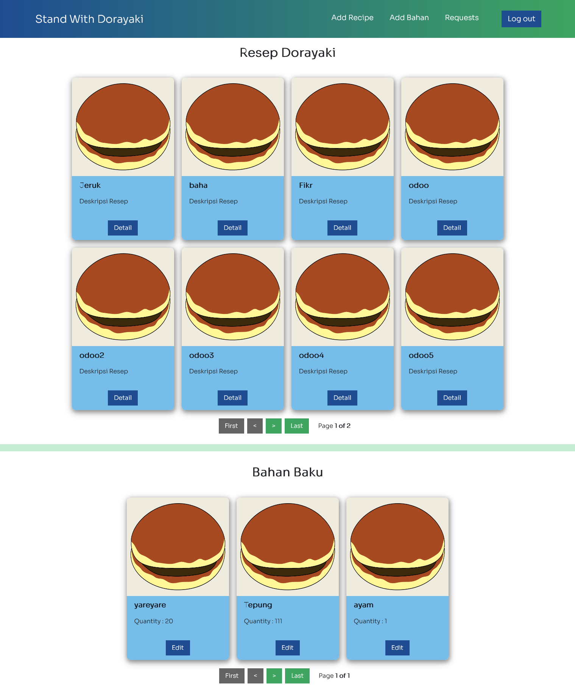
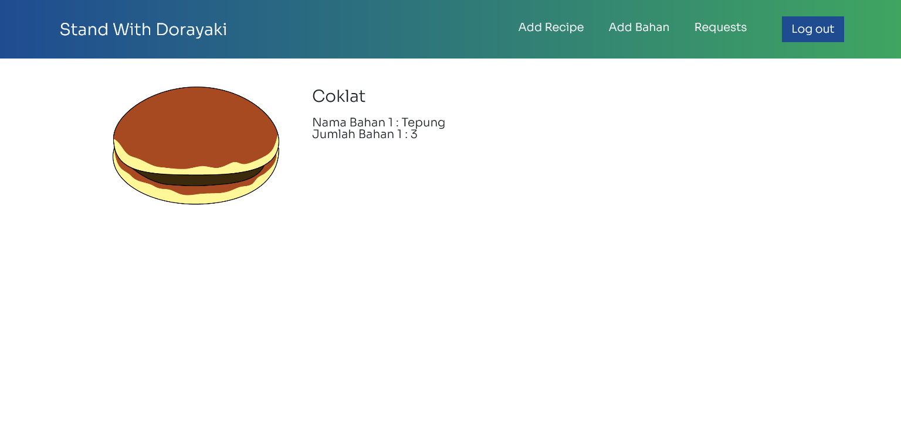
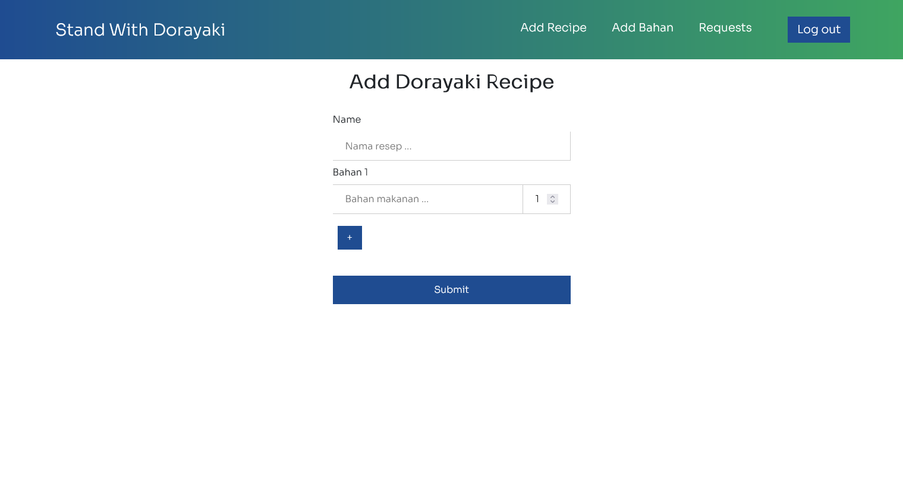
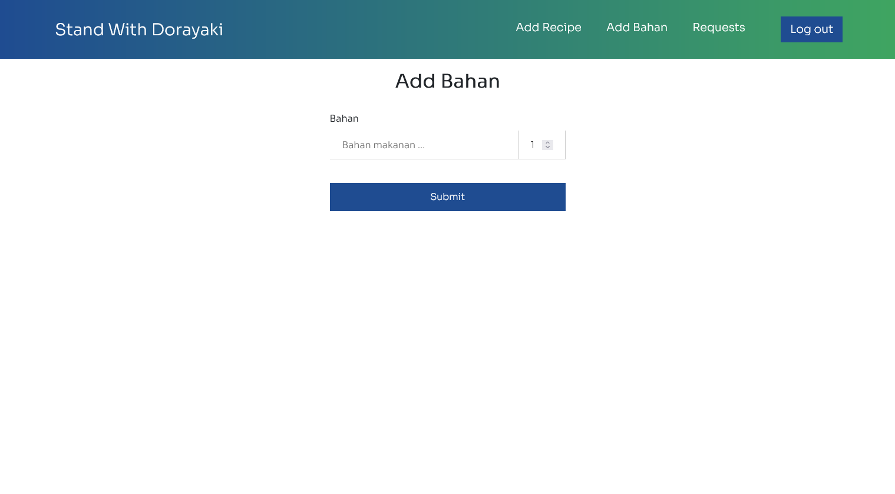
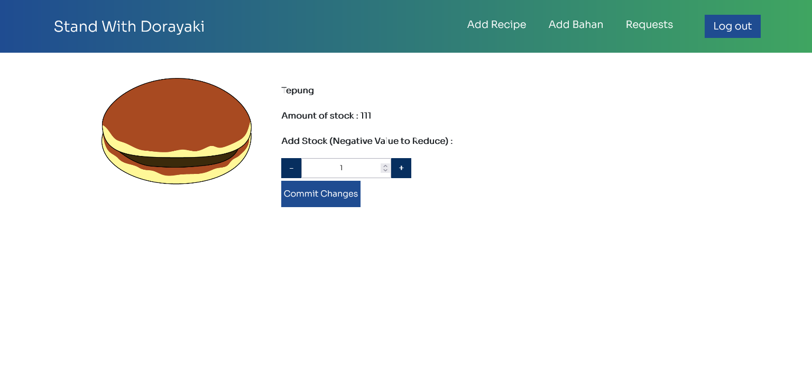
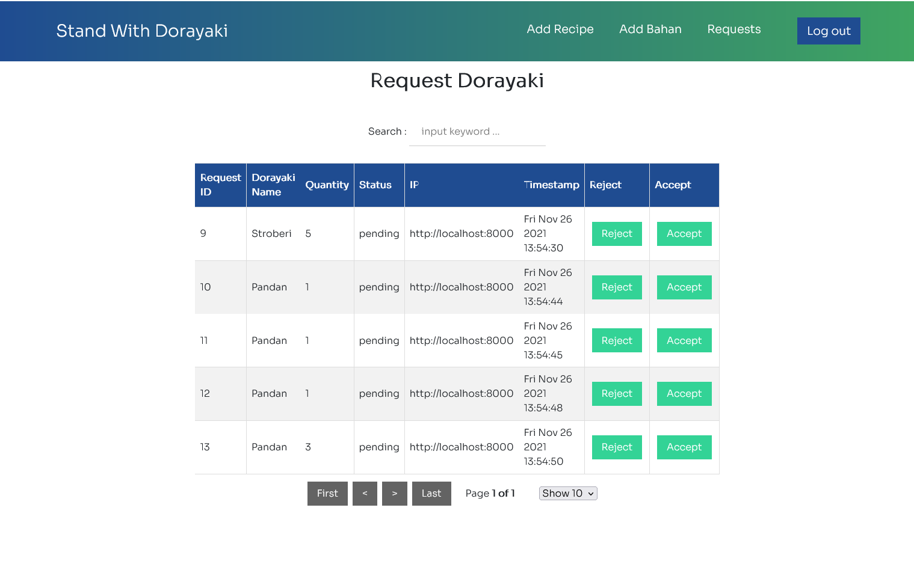

# Dorayaki-Factory-Client
Frontend Pabrik, dibuat menggunakan Node-ReactJS

## Table of contents
  - [Deskripsi Singkat Aplikasi](#deskripsi-singkat-aplikasi)
  - [Screenshot tampilan aplikasi](#screenshot-tampilan-aplikasi-selengkapnya-pada-direktori-screenshots)
  - [Requirements](#requirements)
  - [Cara Menjalankan](#cara-menjalankan)
  - [Pembagian Tugas](#pembagian-tugas)

## Deskripsi Singkat Aplikasi
Aplikasi Web Frontend Pabrik, secara garis besar memiliki fitur bagi admin pabrik untuk melihat dan membuat resep produk dorayaki, melihat, membuat, dan mengubah kuantitas daftar bahan baku, dan melihat dan melakukan review terhadap request yang dilakukan toko. Aplikasi Web dibuat menggunakan NodeJS dan ReactJS, dengan `create-react-app`  

## Screenshot tampilan aplikasi (selengkapnya pada direktori screenshots)
- Login 
- Register 
- Home 
- Detail Resep 
- Add Resep 
- Add Bahan 
- Edit Bahan 
- Daftar Request 
## Requirements
1. [nodejs](https://nodejs.org/en/download/)
2. [npm](https://docs.npmjs.com/downloading-and-installing-node-js-and-npm/)
## Cara Menjalankan
0. Pastikan requirements terpenuhi
1. Jalankan console di direktori aplikasi (dorayaki-factory-client)
2. Pada console, jalankan command berikut untuk menginstal dependency :
   ```
   npm install
   ```
3. Setelah dependency terinstal, jalankan :
   ```
   npm start
   ```
4. Buka `http://localhost:3000` untuk mengakses aplikasi web

## Pembagian Tugas
### Halaman Frontend
- Login : 13519018
- Request : 
### API Routing - Fetch
- Login : 13519018
- Melihat Daftar Request : 13519018
- Mengubah Status Request : 13519018
- Menambah varian resep dorayaki : 13519018